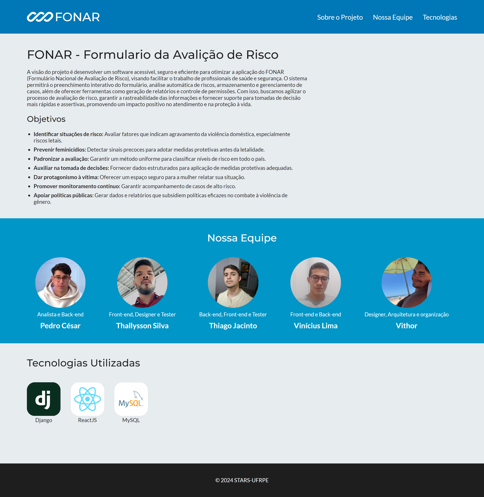

# Apresentação do Projeto FONAR

Uma página de apresentação destinada a exibir as informações principais do projeto e a equipe responsável por desenvolvê-lo, destacando seus objetivos, funcionalidades e tecnologias utilizadas.

O projeto tem como objetivo fornecer uma visão clara e acessível sobre [tema/propósito do projeto], garantindo que os usuários compreendam sua proposta e conheçam os membros da equipe que contribuem para sua realização.

## Screenshots

